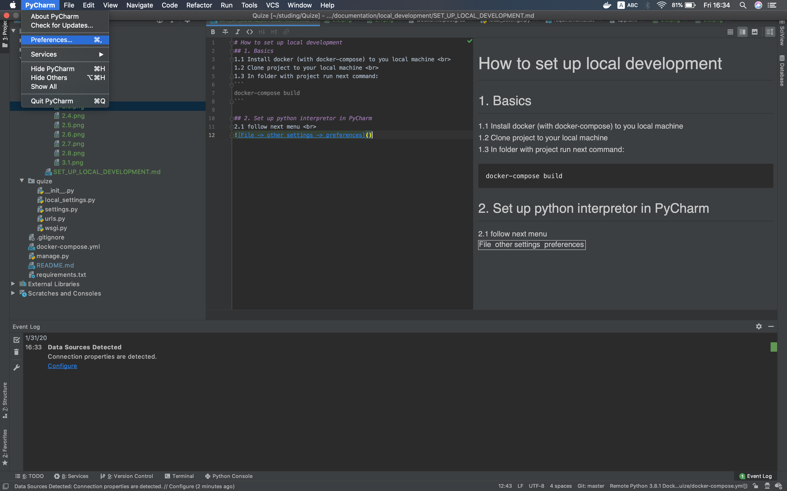
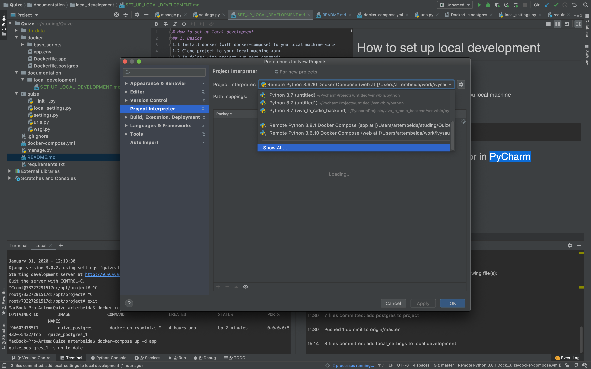
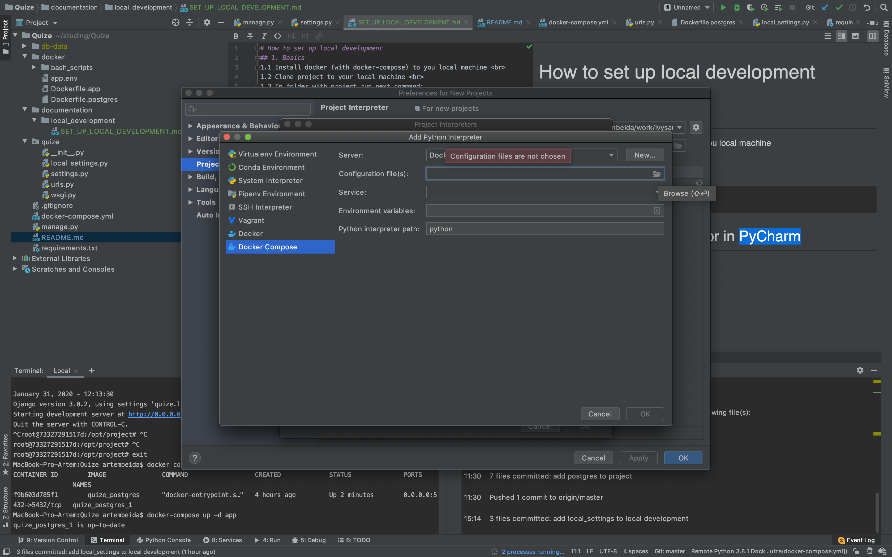
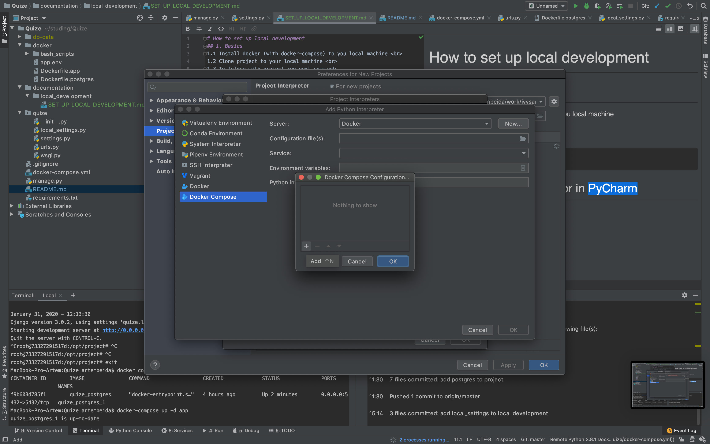
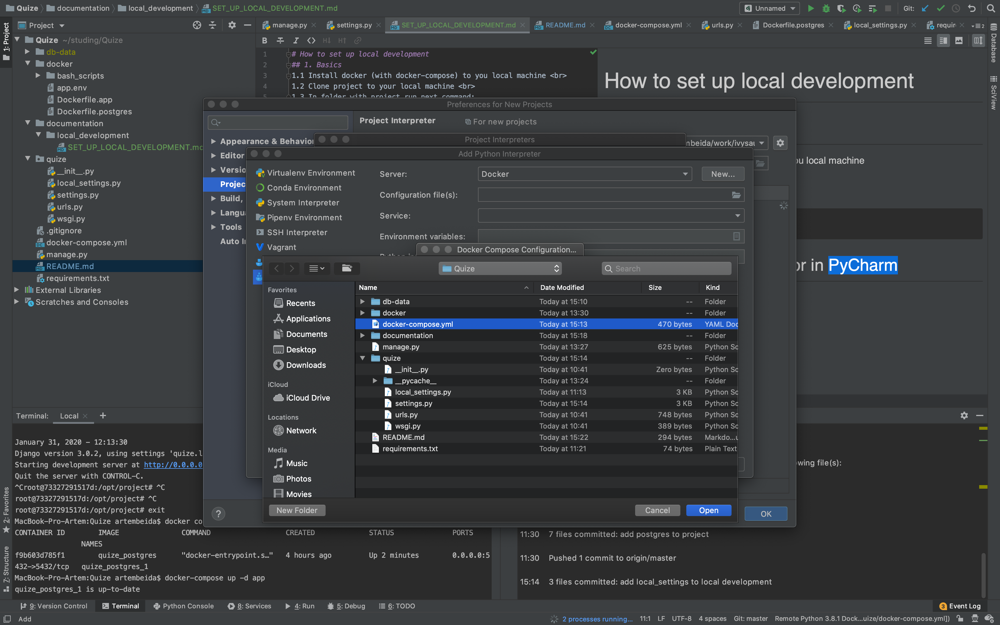
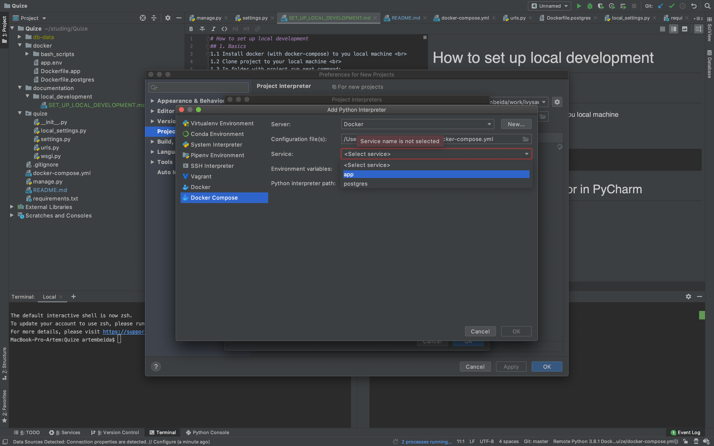
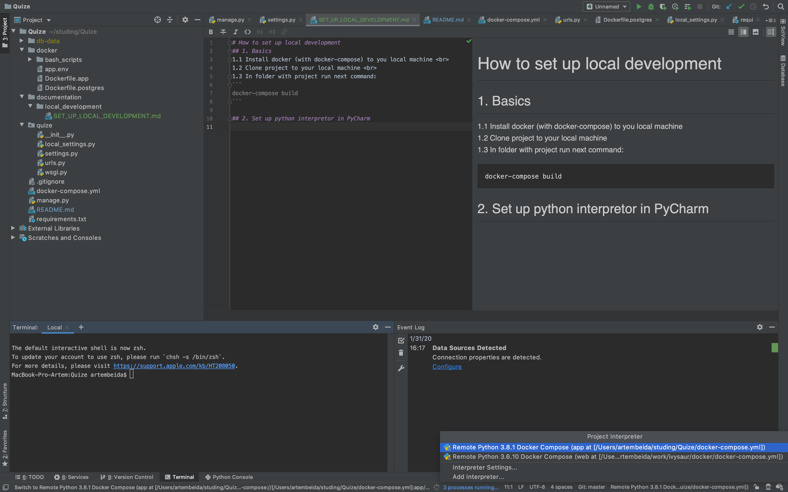
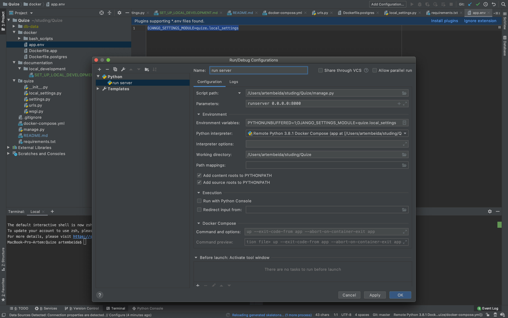

# How to set up local development
## 1. Basics
1.1 Install docker (with docker-compose) to you local machine <br>
1.2 Clone project to your local machine <br>
1.3 In folder with project run next command:
```
docker-compose build
```

## 2. Set up python interpretor in PyCharm
2.1 Follow go to the project preference and chose Docker Compose python interpretor




2.2 Chose `docker-compose.yml` in project root

2.3 Chose service named like `app`

2.4 Apply all changes and select new interpreter to the project level

## 3. How to run local server
3.1 Set up configuration as shown below

After this you can run server through the button
Also you can run through docker with next commands in project root:
```
export DJANGO_SETTINGS_MODULE=quize.local_settings
python manage.py runserver 0.0.0.0:8000
```

Afterall local server will be available by the next url: <br>
https://0.0.0.0:8000/
